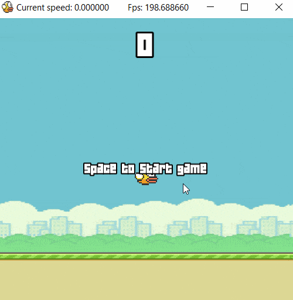

# flappybird-game

Uses [SFML](https://github.com/SFML/SFML) Multimedia Library

**Sounds:** [https://www.sounds-resource.com/mobile/flappybird/sound/5309/](https://www.sounds-resource.com/mobile/flappybird/sound/5309/)
**Font:** [https://www.dafont.com/04b-19.font](https://www.dafont.com/04b-19.font)
**Bird Image:** [https://www.pngfly.com/png-2qnorl/](https://www.pngfly.com/png-2qnorl/)
**Pipe Image:** [https://www.pngkey.com/detail/u2w7q8r5i1w7a9t4_flappy-bird-pipe-png-flappy-bird-pipe-transparent/](https://www.pngkey.com/detail/u2w7q8r5i1w7a9t4_flappy-bird-pipe-png-flappy-bird-pipe-transparent/)
**Background Image:** [http://data.whicdn.com/images/98904071/large.jpg](http://data.whicdn.com/images/98904071/large.jpg)
